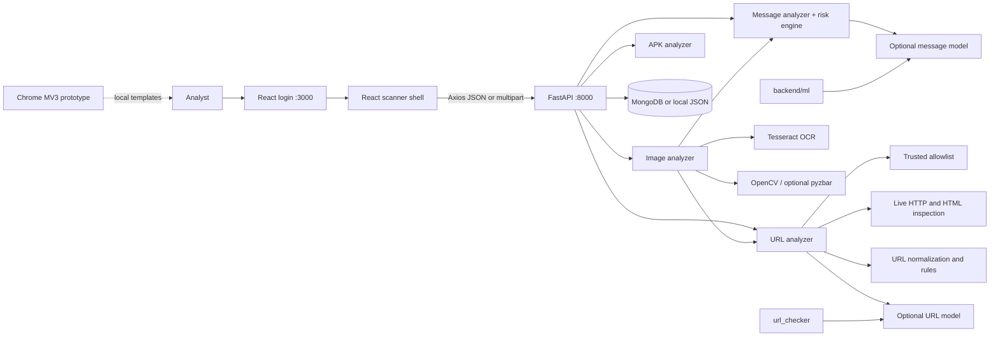

# SafeShield Architecture and AI Context

This document is the repository's maintenance reference. Read it with the implementation. When behavior differs, the code wins and this document should be corrected.

## System Boundary

The frontend is a Vite React 18 single-page shell with state-based page selection, not a router. It calls a fixed Axios base URL (`http://127.0.0.1:8000`). The backend has no database requirement for analysis: `database.py` falls back to `backend/data/analyses_history.json`.

## Authentication Boundary

`POST /login` compares the request against three hard-coded demo users in `backend/main.py`, creates a random `ss_token_*` string, and sets an HttpOnly/Secure/SameSite cookie in the response. The React login page also stores the token, username, and role in local storage and uses the presence of `ss_token` as its route guard.

Important: the backend analysis, history, and report routes do not currently require or validate this token. Authentication is therefore a frontend/demo access gate, not authorization. Any production change must introduce server-side session/token validation, remove hard-coded passwords, and review cookie/local-storage handling.

## Request and Persistence Flow

All analysis routes generate an `SS-XXXXXXXXXX` ID and call `save_analysis` after computing a result. MongoDB is selected when `MONGODB_URI` is configured and initialized successfully. Otherwise, or after a MongoDB failure, local JSON storage is used. Local writes are protected by a process lock, inserted newest first, and capped at 500 records.

Message documents contain `message_hash` from SHA-256 of the trimmed message, not the plaintext. `get_all_analyses` removes any `message` field before returning history and substitutes a short hash target. URL, image, and APK documents use their target metadata. APK analysis results are persisted even though the route returns a richer analyzer result than the history summary.

## Runtime Pipelines

### Message

1. `main.py` validates a JSON body with only `message`, 1-5000 characters.
2. `analyzer/message_analyzer.py` lowercases and whitespace-normalizes the text and emits typed indicator matches for urgency, banking, credentials, finance, downloads, links, threats, and sensitive requests.
3. `risk_engine.py` loads `backend/ml/models/message_model.joblib` lazily when present. Model errors or missing artifacts result in `model_prediction: "unavailable"`.
4. Rule points, strong indicators, combinations, and a high-confidence suspicious model prediction produce a score from 0 to 100. Non-suspicious messages are capped at 24.
5. Risk levels are `LOW` below 25, `MEDIUM` 25-49, `HIGH` 50-74, and `CRITICAL` 75-100. Category selection is ordered and returns stable strings such as `Benign`, `scam`, `phishing`, `credential_theft`, `financial_fraud`, or `malicious_download`.
6. The API stores metadata and returns rule/model confidence, reasons, indicators, and a recommendation.

### URL

`analyzer/url_analyzer.py` is a multi-tier pipeline:

1. `url_normalize.py` creates a canonical URL, adds a scheme when needed, removes selected tracking parameters, and records host/scheme details.
2. Trusted-domain checks in `dataset/utils/allowlist.py`, followed by `dataset/forced_negatives.txt`, provide a Tier 0 fast-path. A match returns score 0, `LOW`, `SAFE`, confidence 99, and no live fetch.
3. Non-allowlisted URLs are evaluated by `url_rules.py` and `url_features.py`. Rules cover malformed hosts, IP addresses, punycode, suspicious paths/parameters, and other URL structure signals.
4. The URL model loads `url_checker/model/url_model_calibrated.pkl`, falling back to `url_model.pkl`. Features are aligned to `feature_names_in_` when available; model errors degrade to rule-only scoring.
5. For valid HTTP(S) domains, `live_inspector.fetch_page` attempts dynamic inspection with a strict roughly 3-second timeout. It collects reachability, status, content type, server, title, forms, password inputs, iframes, hidden iframes, checked links, and executable links. HTML checks can identify credential harvesting, hidden iframes, drive-by payloads, and suspicious content types.
6. Confirmed live threats can force a `FRAUD` verdict and a score in the 90-100 range. If live inspection is unreachable or threat-free, the pipeline falls back to static/model scoring. Static rules remain authoritative enough to prevent a clean zero-indicator URL from becoming fraud solely from an ML result.
7. The response preserves `live_inspection` telemetry and `scoring_breakdown` so the UI can explain which tier was used. URL verdict (`SAFE`, `SUSPICIOUS`, `FRAUD`) and numeric risk level are related but intentionally not identical.

Live inspection performs outbound requests to user-supplied URLs. It is not a full browser, JavaScript runtime, sandbox, or guarantee of safety. Treat SSRF, redirect, timeout, and privacy controls as production security work before exposing this service publicly.

### Image and QR

1. `main.py` accepts JPEG, PNG, WEBP, or BMP uploads at `/analyze/image` and rejects missing, empty, or unsupported files.
2. `image_analyzer.py` decodes the image with Pillow/OpenCV, tries OpenCV QR detection and optional pyzbar, and runs Tesseract OCR.
3. URLs found in QR payloads or OCR text are passed through `analyze_url`. OCR text, or non-URL QR text when OCR is empty, is passed through the message analyzer and risk engine.
4. The aggregate score is the highest nested URL/message score, with a 10-point compound bonus when both are at least 25. Verdict logic escalates for fraud URLs, high/critical text, or elevated combined scores.
5. The response includes `extracted_text`, `qr_codes`, `extracted_urls`, nested `message_analysis`, nested `url_analyses`, `ocr_status`, and `qr_status`. The image record is persisted with the extracted artifacts, so review sensitive uploads and local history access accordingly.

### APK

1. `/analyze/apk` accepts only filenames ending in `.apk`, writes the upload to a temporary file, and deletes it in `finally`.
2. `apk_analyzer.py` uses Androguard to parse the package without executing it. It calculates SHA-256 and reads package/version metadata, permissions, components, DEX/API patterns, manifest issues, network indicators, certificate information, suspicious permissions, and dangerous permission combinations.
3. The analyzer caps the score at 100 and emits `low_risk`, `suspicious`, or `dangerous`. `main.py` adds an uppercase risk level (`LOW`, `HIGH`, or `CRITICAL`) and compatibility aliases such as `component_counts` and `suspicious_apis` for the frontend.
4. Static findings are useful triage evidence only. They cannot establish runtime behavior or prove that an APK is safe.

## API Contract

| Method | Route | Consumer | Notes |
|---|---|---|---|
| GET | `/` | diagnostics | Service metadata, health/docs paths |
| GET | `/health` | frontend startup | Returns service and `1.0.0` version |
| POST | `/login` | Login page | Demo users; no API authorization afterward |
| POST | `/analyze/message` | Message Scanner | JSON message analysis |
| POST | `/analyze/url` | URL Scanner and Image Scanner | JSON URL analysis |
| POST | `/analyze/image` | Image Scanner | Multipart image analysis |
| POST | `/analyze/apk` | APK Scanner | Multipart APK analysis |
| GET | `/history` | Analysis History | `scan_type` filter and `limit` query |
| GET | `/reports/stats` | Reports | Aggregate storage statistics |

Pydantic request models use `extra="forbid"`. Preserve response field names and category/verdict strings: the UI renders them directly and backend tests assert several of them. API consumers should handle `model_prediction: "unavailable"`, empty telemetry, missing OCR, and no persistence service.

## Component Ownership

- `backend/main.py`: FastAPI app, CORS, request/response models, login, IDs, routes, upload validation, and persistence orchestration.
- `backend/analyzer/message_analyzer.py`: deterministic message indicators.
- `backend/risk_engine.py`: message model loading, score/category/recommendation logic, confidence, and message hashing.
- `backend/analyzer/url_analyzer.py`: URL pipeline, allowlist, live inspection, model/rule blend, verdict, telemetry, and feedback logging.
- `backend/analyzer/live_inspector.py`: outbound page fetching and response telemetry.
- `backend/analyzer/image_analyzer.py`: OCR, QR, URL extraction, nested analysis, and aggregation.
- `backend/analyzer/apk_analyzer.py`: Android static inspection and scoring.
- `backend/database.py`: MongoDB selection, local JSON fallback, history sanitization, and report aggregation.
- `backend/ml/`: message feature preparation, training, evaluation, and tests.
- `url_checker/dataset/utils/`: URL normalization, features, rules, allowlist, and feedback support.
- `url_checker/model/`: URL model artifacts and calibration metadata.
- `frontend/src/App.jsx`: authentication state, backend health, navigation, and page rendering.
- `frontend/src/api.js`: Axios calls and multipart construction for all backend endpoints.
- `frontend/src/pages/`: login, scanners, dashboard, history, and reports views.
- `extension/`: standalone MV3 popup prototype; unrelated to the React session and API client.

## AI Change Guidance

Before editing behavior, identify the owning layer and trace the field from analyzer computation through `main.py`, `api.js`, and the consuming page. Make the smallest change consistent with local patterns.

- Add focused backend tests for rules, thresholds, schemas, normalization, upload failures, model fallback, and persistence behavior.
- For URL changes, test trusted domains, safe URLs, suspicious URLs, malformed hosts, IP hosts, punycode, unreachable pages, live threat HTML, and redirect/timeout behavior.
- For image changes, test blank images, invalid files, OCR-unavailable behavior, QR URLs, QR text, and combined URL/message risk.
- For APK changes, test malformed files, benign fixtures, permission-heavy fixtures, and component/API findings without executing packages.
- Keep model loading lazy and failure-tolerant. A missing or incompatible artifact must not disable rule analysis.
- Keep message plaintext out of persistence and diagnostic output. Treat extracted image text, URLs, uploaded APK metadata, raw response snapshots, and feedback datasets as potentially sensitive.
- Do not claim live VirusTotal or Google Safe Browsing integration: current runtime code uses local rules, local models, an allowlist, and the live page inspector.
- Update this document and README when a route, integration, model path, persistence behavior, or prototype status changes.

## Known Gaps

- Replace hard-coded demo authentication with server-enforced authorization before deployment.
- Make the frontend API base URL environment-configurable and align deployment CORS.
- Add frontend tests and broader URL, APK, image, persistence, and authentication tests.
- Decide whether live URL fetching needs stronger SSRF protections, redirect policy, rate limits, and isolation.
- Decide how to expose persistence failures to users rather than only logging fallback behavior.
- Replace static dashboard values with `/reports/stats` data or clearly label the dashboard as a placeholder.
- Reconcile any older `url_checker` documentation that still describes external reputation-provider calls.
